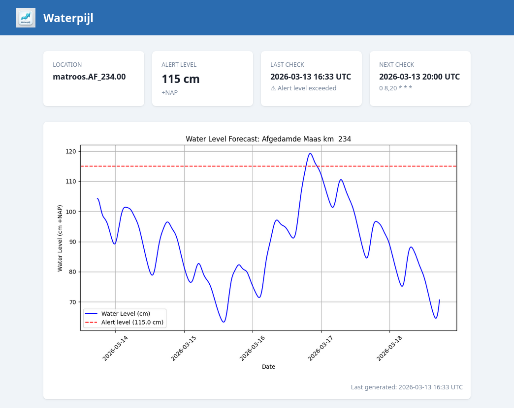

# Waterpijl


Waterpijl monitors the n-day water level forecast for any RWS station and sends an email alert when levels are expected to exceed a configurable alert level.

Runs automatically on a configurable cron schedule via Docker. A web dashboard is available to view the latest forecast and check status.



## Usage

Copy `.env.example` to `.env` and set at minimum:

```
EMAIL_USER=you@gmail.com
EMAIL_PASS=your-gmail-app-password
ALERT_LEVEL=200
```

Then run with Docker Compose:

```bash
docker-compose up -d
```

The dashboard will be available at `http://localhost:8080`.

Or run locally:

```bash
pip install -r requirements.txt
python src/app.py
```

## Configuration

| Variable | Required | Default | Description |
|---|---|---|---|
| `EMAIL_USER` | Yes | — | Gmail address used as the sender |
| `EMAIL_PASS` | Yes | — | Gmail app password |
| `ALERT_LEVEL` | Yes | — | Water level in cm +NAP above which an alert email is sent |
| `EMAIL_TO` | No | `EMAIL_USER` | Recipient for alert emails — defaults to the sender if not set |
| `LOCATION_CODE` | No | `matroos.AF_234.00` | RWS station identifier (default: Nederhemert) |
| `FORECAST_DAYS` | No | `5` | Days ahead to fetch (max 6 — the RWS API will hang beyond that) |
| `CRON_SCHEDULE` | No | `0 8,20 * * *` | Cron expression for when to run checks |
| `WEBAPP_HOST` | No | `0.0.0.0` | Host to bind the web server to |
| `WEBAPP_PORT` | No | `8080` | Port for the web dashboard |
| `DATA_DIR` | No | `./data` | Directory for plot and status persistence |

## How it works

1. Fetches a water level forecast from the [RWS DD API](https://rwsos.rws.nl/wb-api/dd/2.0/timeseries) for the configured station
2. Plots the forecast against the alert level and saves it as `waterlevel_plot.png`
3. If the alert level is exceeded, sends a Dutch-language email alert with the plot attached
4. The web dashboard shows the latest plot, last check result, and next scheduled run
