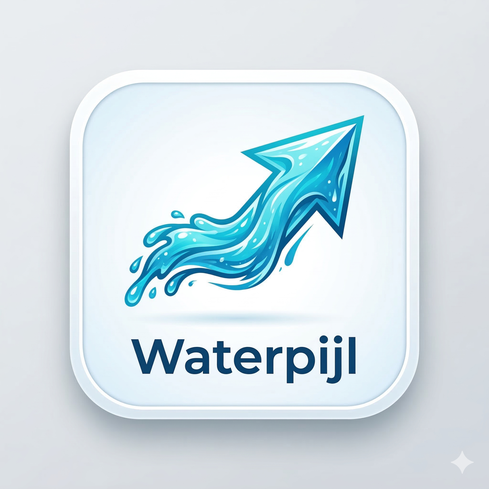
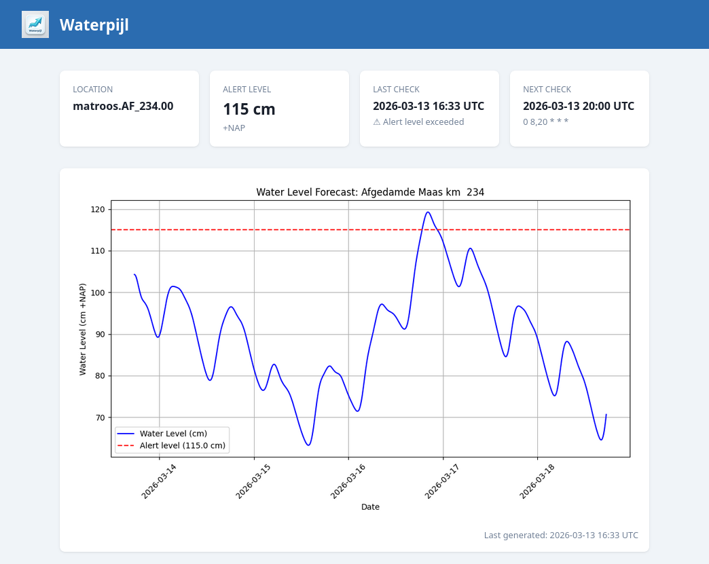

# Waterpijl



Waterpijl monitors the n-day water level forecast for any RWS station and sends an email alert when levels are expected to exceed a configurable alert level.

Runs automatically on a cron schedule configured in `docker-compose.yml`. A web dashboard is available to view the latest forecast and check status. A separate email sidecar container handles sending alerts, decoupled from the main app via a shared queue directory.



## Usage

Copy `.env.example` to `.env` and set at minimum:

```
EMAIL_USER=you@gmail.com
EMAIL_PASS=your-gmail-app-password
LOCATION_CODE=location.code
```

Then run with Docker Compose:

```bash
docker-compose up -d
```

The dashboard will be available at `http://localhost:7261`.

Or run locally (requires [uv](https://docs.astral.sh/uv/)):

```bash
uv sync
uv run python src/app.py
```

## Configuration

| Variable | Required | Default | Description |
|---|---|---|---|
| `EMAIL_USER` | Yes | — | Gmail address used as the sender |
| `EMAIL_PASS` | Yes | — | Gmail app password |
| `ALERT_LEVEL` | No* | `200` | Water level in cm +NAP above which an alert email is sent |
| `EMAIL_TO` | No | `EMAIL_USER` | Recipient for alert emails — defaults to the sender if not set |
| `EMAIL_TEMPLATE_FILE` | No | `email_template.txt` | Path to the Jinja2 template used for the alert email |
| `EMAIL_QUEUE_DIR` | No | `/data/queue` | Shared outbox dir where the app drops email jobs and the sidecar reads them |
| `EMAIL_POLL_INTERVAL` | No | `10` | Seconds between queue polls (email container) |
| `EMAIL_MAX_ATTEMPTS` | No | `10` | Max send attempts before a job is marked failed (email container) |
| `LOCATION_CODE` | Yes | — | RWS station identifier. Set in `docker-compose.yml` by default |
| `FORECAST_DAYS` | No* | `5` | Days ahead to fetch (max 6 — the RWS API will hang beyond that). Set in `docker-compose.yml` by default |
| `CRON_SCHEDULE` | No* | `0 8,20 * * *` | Cron expression for when to run checks. Set in `docker-compose.yml` by default |
| `WEBAPP_HOST` | No* | `0.0.0.0` | Host to bind the web server. Left to app default |
| `WEBAPP_PORT` | No* | `7261` | Internal app port (and default Docker host port) |
| `DATA_DIR` | No* | `/data` (Docker) / `./data` (local) | Directory for plot and status persistence |

\* Not required in `.env` for Docker Compose with this repository defaults.

## Finding your Location Code

You need an RWS station identifier (`LOCATION_CODE`) to monitor a specific water level point.

### The Manual Way
1. Navigate to the [RWSOS Viewer Map](https://rwsos.rws.nl/viewer/map/rivieren/waterkwantiteit/).
2. Click on the specific measurement dot you want to track.
3. Look at your browser's address bar. The URL will update to something like:
   `https://rwsos.rws.nl/viewer/map/rivieren/waterkwantiteit/location/matroos.AF_234.00?pd=-2;2`
4. Extract the location ID immediately following `/location/`. In this example, it is `matroos.AF_234.00`.

### The API Way (Full List)
If you want to view or parse the complete list of available locations, you can query the RWS Digitale Delta API directly via its GeoJSON endpoint:

```http
https://rwsos.rws.nl/wb-api/dd/2.0/locations/geojson?observationTypeId=waterlevel&sourceName=fews_rmm_km
```

> Note on sourceName: RWS mixes physical sensors, astronomical tide predictions, and regional simulation models. The sourceName parameter (e.g., fews_rmm_km) filters the response to a specific forecasting model or network, preventing the API from returning every single observation node in the country.

## How it works

1. Fetches a water level forecast from the [RWS DD API](https://rwsos.rws.nl/wb-api/dd/2.0/timeseries) for the configured station
2. Plots the forecast against the alert level and saves it as `waterlevel_plot.png`
3. If the alert level is exceeded, drops an email job (JSON + plot copy) into a shared queue directory; a separate `email` sidecar container renders the alert from the Jinja2 template and sends it, retrying with backoff on failure
4. The web dashboard shows the latest plot, last check result, and next scheduled run

The sidecar split means email credentials (`EMAIL_USER`, `EMAIL_PASS`, `EMAIL_TO`) are read only by the `email` container — the main app never sees them. Both containers share the `/data` volume for job handoff.
